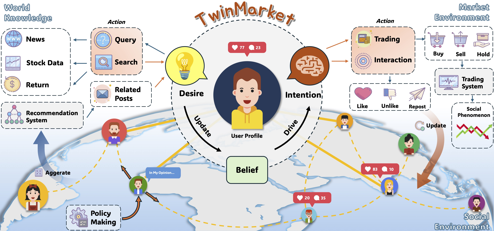
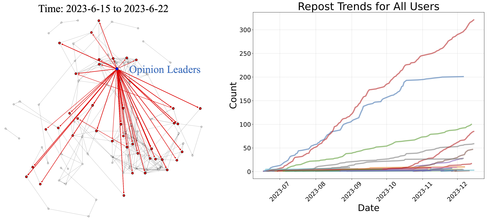
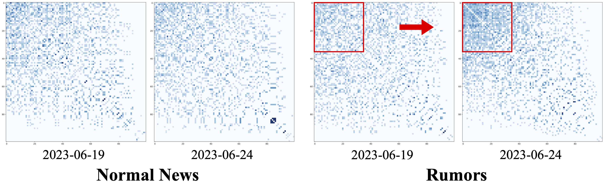
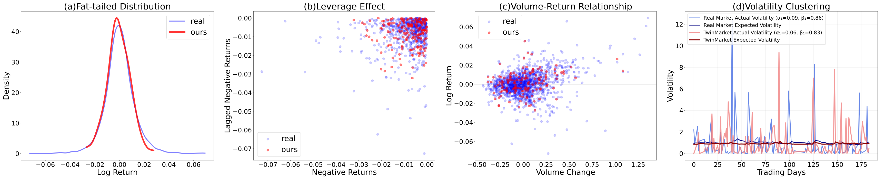
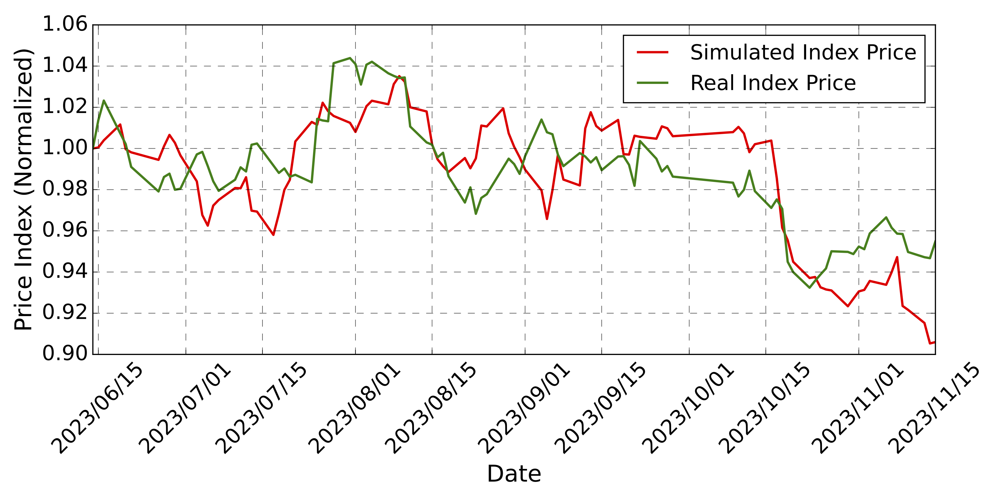

# TwinMarket: A Scalable Behavioral and Social Simulation for Financial Markets



## Overview
**TwinMarket** is a novel multi-agent framework designed to simulate socio-economic systems using large language models (LLMs). The framework focuses on modeling individual investor behaviors and their interactions within a simulated stock market environment. By leveraging the **Belief-Desire-Intention (BDI)** framework, TwinMarket captures the cognitive processes of agents, enabling the study of emergent phenomena such as financial bubbles, recessions, and market volatility.

The project aims to bridge the gap between micro-level individual decision-making and macro-level collective market dynamics, providing insights into how individual actions aggregate to form complex socio-economic patterns.

## Key Features
1. **Real-World Alignment**: The framework is grounded in established behavioral theories and calibrated with real-world data, ensuring realistic human behavior modeling.
2. **Dynamic Interaction Modeling**: TwinMarket captures diverse human behaviors and their interactions, particularly in the context of information propagation and social influence.
3. **Scalable Market Simulations**: The framework supports large-scale simulations, allowing researchers to analyze the impact of group size and interaction complexity on market behavior.

## Framework Components
### Micro-Level Simulation: Individual Behaviors
- **BDI Framework**: Agents are modeled using the **Belief-Desire-Intention** framework, which structures their decision-making processes.
- **Behavioral Biases**: Agents exhibit various behavioral biases such as overconfidence, loss aversion, and herding behavior, reflecting real-world investor psychology.

### Macro-Level Simulation: Social Interactions
- **Social Network Construction**: Agents interact within a dynamic social network, where connections are based on trading behavior similarity.
- **Information Propagation**: The framework models how information spreads through the network, leading to phenomena like opinion polarization and echo chambers.

### Data Sources


- **Real-World Data**: TwinMarket integrates real user profiles, transaction details, stock data, and news articles to create a realistic simulation environment.
- **Initial User Profiles**: User profiles are generated using real transaction data from platforms like Xueqiu, ensuring diversity in agent behavior.

## **Experimental Results**  

### **Information Propagation**  

  

In addition to modeling market dynamics, we investigated the process of **rumor propagation within the network** and its impact on the broader financial system. Our findings suggest that during the spread of information, certain individuals emerge as **opinion leaders**, exerting a disproportionate influence on the network. These key actors play a crucial role in amplifying, filtering, or distorting information flow, which in turn shapes market sentiment and trading behaviors.  

  

Moreover, our analysis reveals that exposure to varying information signals can lead to **behavioral polarization** among market participants. Under specific conditions, traders form distinct groups with divergent beliefs or strategies regarding market trends. This polarization effect can heighten market volatility, disrupt price stability, and generate self-reinforcing feedback loops that further entrench collective decision-making patterns. These results underscore the significant role of **social influence** in shaping financial market behavior.  

### **Market Dynamics**  

  

TwinMarket successfully replicates several well-documented **empirical characteristics of financial markets**, demonstrating its ability to capture complex market behaviors. Key features include:  

- **Fat-tailed return distributions**, where extreme price fluctuations occur more frequently than a normal distribution would predict, reflecting heavy-tailed risk.  
- **Volatility clustering**, characterized by persistent periods of high and low volatility, where market fluctuations exhibit temporal dependencies.  
- **Leverage effects**, where negative returns are associated with increased future volatility, highlighting asymmetries in market behavior.  
- **Volume-return relationships**, where trading volume correlates with price movements, illustrating the impact of liquidity on market dynamics.  

Additionally, the framework reveals **emergent group behaviors** that are difficult to capture using conventional agent-based models. These include **self-fulfilling prophecies**, where collective expectations drive market trends, and **information cascades**, where traders rely on perceived consensus rather than fundamental analysis. Such emergent properties highlight TwinMarket’s capacity to bridge **micro-level agent interactions with macro-level market phenomena**, offering a robust and adaptive simulation environment for studying financial systems.

## Scalability



TwinMarket is designed to scale to large populations, with simulations involving up to **1,000 agents**. The framework maintains realistic market dynamics even at larger scales, providing a robust platform for studying complex socio-economic systems.

## How to Cite
If you use TwinMarket in your research, please cite the following paper:

```bibtex
@misc{yang2025twinmarketscalablebehavioralsocialsimulation,
      title={TwinMarket: A Scalable Behavioral and Social Simulation for Financial Markets}, 
      author={Yuzhe Yang and Yifei Zhang and Minghao Wu and Kaidi Zhang and Yunmiao Zhang and Honghai Yu and Yan Hu and Benyou Wang},
      year={2025},
      eprint={2502.01506},
      archivePrefix={arXiv},
      primaryClass={cs.CE},
      url={https://arxiv.org/abs/2502.01506}, 
}
```